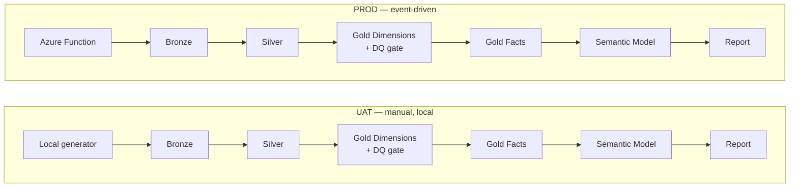

# Current status

Last updated: 2026-08-19 (Bangkok)

## At a glance

- UAT and PROD are both validated end-to-end. Schedules and event triggers
  are **disabled** — the project is in a stable, manual-validation state.
- All 6 originally-planned report pages exist and are validated (5
  pre-existing pages — Executive Overview, Sales & Demand, Inventory &
  Fulfillment, Data Quality Dashboard, Data Health — plus the 3 newly built:
  Transportation & Shipping, Network & Cost-to-Serve, Scenarios &
  Recommendations; 8 pages live in total).
- The 5 Silver DQ fixes, 3 new Gold facts, semantic model additions, and 3
  new report pages have all been **promoted from UAT to PROD** and
  validated with live batches.
- Found and fixed a real, pre-existing PROD bug: `nb_incremental_gold_dimensions`
  was bound to **UAT's** Lakehouse instead of PROD's, so PROD's centralized
  DQ gate had never genuinely validated PROD's own data. Fixed and
  reverified.
- PROD's Silver/Gold tables were cleaned down to exactly one validated
  batch (`sc-prod-promo-validate-20260818-02`).
- **2026-08-19:** fixed a cosmetic DQ gate bug (wrong column read for the
  "N failed checks" message) on both UAT and PROD, and reprocessed UAT's
  historical `slv_delivery_event` backlog (~1,563 rows wrongly quarantined
  by a since-fixed rule, now VALID and in Gold) — see the fixes log below.

## Pipeline flow

UAT and PROD are separate, unconnected lanes (no data flows between them) —
each has its own workspace, Lakehouse, and pipeline.

## Environment reference

| | UAT | PROD |
| --- | --- | --- |
| Workspace | `SupplyChain-UAT` | `SupplyChain-PROD` |
| Lakehouse | `lh_supply_chain_UAT` | `lh_supply_chain_PROD` |
| Pipeline | `pl_supply_chain_incremental_UAT` | `pl_supply_chain_event_PROD` |
| Entry point | Local generator, manual Bronze upload | Azure Function (`func-sc-event-PROD-0812`), direct OneLake write |
| Azure Function | Not used | Enabled, route `/api/generate-batch` |
| Latest validated batch | `2026/08/25` (watermark `2026-08-25T06:00:00`) | `sc-prod-promo-validate-20260818-02` |
| Latest pipeline job | `77d9ba26-79e3-499b-981c-564ce174968a` | `a6bedeed-bed1-4585-8c07-f30f978faf86` |
| Volume profile | — | ~1,600 orders / ~4,800 order lines per batch |
| Schedule / trigger | Disabled | Disabled |

## Report pages

| # | Page | Grain / notes |
| --- | --- | --- |
| 1 | Transportation & Shipping | OTIF %, On-Time Dispatch %, delay/transit by carrier & destination region |
| 2 | Network & Cost-to-Serve | Logistics cost by customer region / carrier / route (no SKU-level basis in Gold) |
| 3 | Scenarios & Recommendations | Power BI **What-If Parameters** (Cost Savings Target %, OTIF Improvement Target %) — no physical `dim_scenario` exists |

Pages 1–3 above were newly built this project phase and are live in both
UAT and PROD. See the appendix for full visual inventories.

## Key fixes log

| Date | Area | Issue | Fix |
| --- | --- | --- | --- |
| 2026-08-18 | UAT Silver (fulfillment) | `proof_of_delivery_flag` quarantined 100% of non-`DELIVERED` delivery events | Added `event_type == "DELIVERED"` condition to the null check |
| 2026-08-18 | UAT Silver (4 tables) | `slv_demand_forecast`/`slv_inventory_snapshot` required-null on legitimately-blank fields; `slv_supplier`/`slv_product` silently dropped or filtered quarantined rows | Loosened rules / converted to quarantine-and-keep pattern |
| 2026-08-18 | UAT/PROD Report | TMDL `formatString` starting with `#` rendered literal quote chars in KPI cards | Rewrote format strings to avoid a leading `#` |
| 2026-08-18 | PROD Silver (`slv_supplier`) | Schema-evolution backfill gap: existing rows got `dq_status = NULL`, broke orphan-key checks | One-time `UPDATE ... WHERE dq_status IS NULL` backfill |
| 2026-08-18 | PROD Gold Dimensions | Notebook bound to **UAT's** Lakehouse — PROD's DQ gate silently never validated real PROD data | Fixed `dependencies.lakehouse` metadata, reverified with a live batch |
| 2026-08-18 | Semantic model (both) | What-If parameter `sourceColumn` used the display name instead of `GENERATESERIES`' actual `Value` column — silently discarded on import | Set `sourceColumn: [Value]` |
| 2026-08-19 | Gold Dimensions (UAT+PROD) | DQ gate's `dq_score` / "N failed checks" message read the `severity` column instead of `status` | Changed `row[5]` → `row[6]`, pushed & verified both environments |
| 2026-08-19 | UAT Silver historical backlog | ~1,563 `slv_delivery_event` rows (`PICKED_UP`/`IN_TRANSIT`) stayed quarantined after the `proof_of_delivery_flag` code fix — a code fix doesn't reprocess rows already quarantined under the old rule | One-time backfill UPDATE on `slv_delivery_event` + direct re-merge into `gld_fact_delivery_event`; UAT only |

Full root-cause narratives for each of these are in the appendix.

## Known gaps

- **Phase 5** (findings write-up / screenshots for the portfolio) — not
  started.
- The 2026-08-19 DQ gate fix hasn't been validated against a live batch
  with real `FAIL` rows yet — spot-check the next batch's `dq_score`
  message against `ops_data_quality_summary`'s actual `status` counts.

## Quality and modeling contract

- Silver uses business-key MERGE logic and a newer `source_updated_at`
  watermark for each new incremental batch.
- Silver can quarantine invalid records; Gold consumes only `VALID` records.
- Missing tables, schema violations, duplicate business keys, required nulls,
  and orphan foreign keys are blocking DQ checks.
- A row-count decrease greater than 30% is recorded as an operational warning
  and the accepted run establishes the next comparison baseline.
- `gld_dim_date` derives coverage from the relevant Silver fact date columns,
  including requested delivery, receipt, dispatch, demand, and inventory dates.
- Semantic Model refresh follows Gold Facts; the report reads through Direct
  Lake from the refreshed model.

## Environment contract

| Environment | Generator | Delivery | Pipeline start | Azure Function |
| --- | --- | --- | --- | --- |
| UAT | Local Python | Manual upload | Manual CLI run | None |
| PROD | Azure Function | Direct OneLake write | Function submission | Enabled |

Keep transformation notebooks aligned between environments, but preserve the
different runtime entry points and workspace bindings.

## Safe operating rules

- Use a new batch ID for every delivered batch.
- Ensure `source_updated_at` is newer than the live Silver watermark.
- Validate manifest counts, key relationships, and representative CSV changes
  before upload.
- Run one bounded pipeline execution at a time.
- Inspect the run-specific status and downstream Semantic Model/report result.
- Keep schedules and event triggers disabled during controlled validation.
- Do not store credentials, Function keys, or connection secrets in the repo.

---

## Appendix: detailed history and lessons learned

The sections below are the full narrative record behind the fixes log
above — root causes, verification steps, and lessons — kept for future
debugging. The quick-reference sections above are the fast-read summary;
this is the deep-dive.

### PROD promotion (2026-08-18)

Promoted everything UAT had that PROD didn't, verified against the live PROD
workspace before touching it (not assumed from docs) using the same
export → diff → apply → import → verify round-trip pattern as UAT:

- **Silver notebooks** (`nb_incremental_silver_fulfillment`,
  `nb_incremental_silver_planning_ops`, `nb_incremental_silver_supplier`,
  `nb_incremental_silver_product`): applied the same 5 DQ fixes UAT already
  had. Confirmed via live diff that PROD was still on the pre-fix logic for
  all 5 (e.g. `proof_of_delivery_flag` was still checked unconditionally).
- **Gold notebooks** (`nb_incremental_gold_facts`,
  `nb_incremental_gold_dimensions`): added the write/DQ-gate registration for
  the 3 new facts. PROD's Silver layer already had `slv_delivery_event`,
  `slv_logistics_cost`, `slv_disruption` — only Gold wasn't consuming them
  yet.
- **Semantic model** (`sm_supply_chain_PROD`): added the 3 new Gold fact
  tables, 2 What-If parameter tables, and all dependent measures. Discovered
  along the way that PROD's `gld_fact_shipment` was missing **5 measures**
  entirely (`On-Time Dispatch %`, `OTIF %`, `Avg Delivery Delay Days`,
  `Avg Actual Transit Days`, plus the new `Scenario OTIF %`) — these all
  depend on `gld_fact_delivery_event`, which didn't exist in PROD's model
  before this promotion, so they'd never been added even though the file
  existed. Also fixed the same formatString quote-bug on `Shipment Count`
  that UAT had already fixed (PROD still had `'#,0'`). **Lesson: checking
  that a table file exists in the target environment is not the same as
  checking its measures match — diff content, not just presence.**
- **Report** (`rpt_supply_chain_PROD`): added the same 3 pages built in UAT
  (Transportation & Shipping, Network & Cost-to-Serve, Scenarios &
  Recommendations), copied directly from the verified UAT page JSON since
  visuals only reference table/measure names, not workspace bindings.

All 4 pushes verified via byte-identical (JSON-equal) round-trip re-export
before being trusted. Confirmed the existing PROD report/measures still work
after all of this (`[Shipment Count]` still returns 3202 via a live DAX
query) — the promotion did not disturb anything already working.

### Gold Dimensions Lakehouse misattachment (found and fixed 2026-08-18)

Ran a validation batch (`sc-prod-promo-validate-20260818-01`) through the
Function → pipeline path to populate the 3 new Gold facts. The pipeline
reported `Failed` at `act_semantic_model_refresh` (missing-table error,
expected — see below), but a deeper check turned up something more serious:
`ops_pipeline_run_log`, `ops_data_quality_summary`, and `gld_dim_date` on
PROD showed **zero new rows** for that run, even though the Fabric job
history showed `nb_incremental_gold_dimensions` completed with no error in
~4 minutes and downstream `nb_incremental_gold_facts` (which depends on it
succeeding) ran and wrote real data.

Root cause, confirmed directly (not inferred): `nb_incremental_gold_dimensions`
on PROD had its own notebook-level `dependencies.lakehouse` metadata pointing
at **`lh_supply_chain_UAT`** (workspace `ba24b737-...`) instead of
`lh_supply_chain_PROD` — the only one of the 7 promoted PROD notebooks
misconfigured this way; `nb_incremental_gold_facts` and all 4 Silver
notebooks were correctly bound to PROD. Confirmed the actual impact by
checking **UAT's own** `ops_pipeline_run_log` and finding a fresh
`nb_incremental_gold_dimensions_merge_v2` STARTED/SUCCESS pair logged at the
exact timestamp of the PROD pipeline's activity window — the notebook's
Spark session was reading and writing against UAT's Lakehouse the whole
time, decided UAT had no new Silver watermark, and skipped out, having never
touched PROD's actual batch. This is a **pre-existing PROD misconfiguration,
not something introduced this session** — it likely means PROD's centralized
DQ gate (cross-table orphan-key/duplicate checks) has not been genuinely
validating PROD's data on any prior run either, though per-table Silver
`dq_status` quarantine (unaffected by this binding) was still protecting
against row-level bad data throughout.

Fixed by correcting the notebook's `dependencies.lakehouse` block via
`fab export` → edit metadata (not code) → `fab import`, verified the fix
landed, then ran a second validation batch
(`sc-prod-promo-validate-20260818-02`). That batch's pipeline job completed
fully (including `act_semantic_model_refresh`, no failure this time).
Confirmed for real: `ops_pipeline_run_log` shows
`nb_incremental_gold_dimensions_merge_v2` taking the **full processing path**
(not skip) and succeeding; `gld_dim_date` grew from 3 rows to 1,604 rows
(now covering the batch's full date range through 2031-01-05); the DQ
dashboard's "Latest DQ Check" moved to today; and the report pages
(Transportation & Shipping, Data Quality Dashboard) render real data with no
field errors when checked live in the browser.

**Separately noticed while verifying, since fixed (2026-08-19):** the DQ
gate's own `dq_score`/"N failed checks" summary message was computed from a
pre-existing bug — `failed_checks = sum(1 for row in dq_rows if row[5] ==
"FAIL")` read column index 5, which is `severity`, not `status`. Several
check types hardcode `severity="FAIL"` regardless of outcome (that's their
blocking *category*, not their result), so the printed score/count was
misleading — a batch could show e.g. "51 failed checks" in that message
while the real `status = 'FAIL'` row count was 0. The actual gate-blocking
logic (the `failures` list that triggers `raise ValueError(...)`) was always
computed correctly and was unaffected — only the cosmetic score/message was
wrong. Fixed by changing the index to `row[6]` in both
`nb_incremental_gold_dimensions_UAT.py` (and its `.Notebook/*.ipynb`
mirror) and pushed to both live Notebook items
(`nb_incremental_gold_dimensions_UAT.Notebook` on UAT,
`nb_incremental_gold_dimensions.Notebook` on PROD, since PROD carried the
same bug independently) via the standard `fab export` → edit → `fab
import` → re-export → verify round-trip. Confirmed via re-export on both
environments that `row[6]` landed and `row[5]` is gone; PROD's
`dependencies.lakehouse` binding was also re-confirmed still pointing at
`lh_supply_chain_PROD` (unaffected by this push, but worth re-checking
given the earlier misattachment incident). Not yet validated against a live
pipeline run with real FAIL rows — the fix is a straightforward index
correction, but the printed dq_score/message on the next batch should be
spot-checked against `ops_data_quality_summary`'s actual `status` counts to
be sure.

The 3 new Gold fact tables are populated in PROD with real data. Note these
validation batches were mechanical (mostly-fixed relative timestamps, not
the randomized realistic generator) — `OTIF %` / `On-Time Dispatch %` show
blank in the report because every shipment computes as delivered slightly
after its deadline; that's a property of this test batch's data pattern,
not a bug.

**Post-validation cleanup (2026-08-18), in two stages:**

1. Deleted the leftover raw Bronze CSVs and `Files/event_batches/`
   manifests for superseded test/failed batches — the four
   `sc-prod-e2e-20260816-*` and two `sc-prod-volume-e2e-20260816-*` batches
   from before this session, plus `sc-prod-promo-validate-20260818-01` (the
   first validation attempt, superseded by `-02` once the Lakehouse
   attachment was fixed). Bronze is append-only raw-file landing already
   merged into Silver/Gold; deleting it doesn't touch the merged Delta
   tables under `Tables/`.
2. That still left old batches' **rows** sitting in the merged Silver/Gold
   Delta tables (MERGE/upsert doesn't separate by batch). Built a new,
   reusable notebook, `nb_prod_data_reset` (kept in the PROD workspace
   intentionally — set `CUTOFF` at the top before each use), that:
   deletes Silver rows with `source_updated_at` older than a chosen cutoff;
   cleans Gold fact/dimension tables by anti-joining against the now-cleaned
   Silver tables on their natural merge key (Gold carries no
   `source_updated_at` of its own); and rebuilds `gld_dim_date` from scratch
   using the same contiguous-calendar logic `nb_incremental_gold_dimensions`
   uses, since it has no natural key to anti-join on. Ran it with
   `CUTOFF = "2026-08-18T13:00:00"` (keeping only `sc-prod-promo-validate-
   20260818-02`, ingested 13:26:41). Verified via live DAX: every fact
   table now matches exactly one clean batch's expected volume
   (`gld_fact_shipment` 6,402 → 1,600; `gld_fact_delivery_event` → 4,800;
   `gld_fact_logistics_cost` → 4,800; `gld_fact_disruption_event` → 1,600),
   `gld_dim_date` shrank from 1,604 to 1,602 rows with `MinDate` moving from
   2026-08-16 to 2026-08-18, and the live report (Transportation &
   Shipping) renders the same clean 1,600/4,800 figures with no errors.

PROD's `Files/event_batches/` now holds only `sc-prod-promo-validate-20260818-02`,
and Silver/Gold contain only that batch's rows.

### UAT module build-out

Building the three report modules that were planned in `PROJECT_PLAN.md` but
never implemented. UAT only; PROD promotion was a separate later step (see
"PROD promotion" above).

**Gold layer** — `slv_delivery_event`, `slv_logistics_cost`, and
`slv_disruption` existed in Silver but were never promoted to Gold. Added:

- `gld_fact_delivery_event` (delivery_event_id, shipment_id, event_sequence,
  event_type, event_timestamp, event_location, proof_of_delivery_flag)
- `gld_fact_logistics_cost` (cost_id, shipment_id, order_id, cost_component,
  amount, currency_code, posting_date)
- `gld_fact_disruption_event` (disruption_id, scope_type, scope_id,
  event_type, start_date, end_date, severity, delay_multiplier)

Edited: `notebooks/incremental_v2/nb_incremental_gold_dimensions_UAT.py`
(`DQ_TABLE_RULES`, `DQ_REFERENTIAL_RULES`, `gld_dim_date` source columns) and
`nb_incremental_gold_facts_UAT.py` (three new `merge_delta` blocks). Validated
end to end with UAT batch `2026/08/22` (pipeline job
`f39f7830-0a9b-4b6e-97a9-c249a7c18561`).

Two DQ-rule decisions worth remembering:

- The Gold `required_field_nulls` check scans *all* rows of a Silver table,
  not just `VALID` ones. `DQ_TABLE_RULES` for these three tables only lists
  true identity/FK columns (matching the existing pattern, e.g.
  `slv_shipment` excludes `planned_dispatch_timestamp`) — listing an
  attribute column that Silver's own quarantine logic can null out (e.g.
  `event_timestamp`, `amount`) blocks Gold on quarantined historical rows.
  Confirmed live: 250 historical `slv_delivery_event` rows have a null
  `event_timestamp` from `INVALID_EVENT_TIMESTAMP` quarantines.
- No `DQ_REFERENTIAL_RULES` entry for `slv_delivery_event.shipment_id` or
  `slv_logistics_cost.shipment_id` → `slv_shipment.shipment_id`. The
  orphan-key check compares `VALID`-only rows on both sides; a shipment that
  resolved fine at Silver-join time but is itself quarantined for an
  unrelated reason (confirmed: `INVALID_PLANNED_DISPATCH`, ~76–231 affected
  rows) would incorrectly block Gold. A truly missing `shipment_id` is
  already caught at Silver join time (`UNRESOLVED_SHIPMENT_ID`).

`slv_delivery_event` used to quarantine ~63% of rows
(`INVALID_PROOF_OF_DELIVERY_FLAG`) because `proof_of_delivery_flag` is only
meaningful on the `DELIVERED` event and is blank on `PICKED_UP`/`IN_TRANSIT`
rows — confirmed live via DAX that this had dropped **100%** of
`PICKED_UP`/`IN_TRANSIT` events before they ever reached Gold
(`gld_fact_delivery_event` held only `DELIVERED`, 1,563 rows, zero of
anything else). See "Silver DQ fix" below — this was fixed.

**Semantic model** (`semantic_model/uat_v2/sm_supply_chain_UAT.SemanticModel/`)
— added the three Gold facts as Direct Lake tables (own `.tmdl` files under
`definition/tables/`), wired into `relationships.tmdl`, and added measures:

- `gld_fact_shipment`: `OTIF %`, `On-Time Dispatch %`,
  `Avg Delivery Delay Days`, `Avg Actual Transit Days`
- `gld_fact_logistics_cost`: `Total Logistics Cost`, `Freight Cost`,
  `Fuel Surcharge Cost`, `Warehouse Handling Cost`, `Cost per Order`,
  `Cost per Shipment`
- `gld_fact_disruption_event`: `Disruption Count`,
  `High Severity Disruption Count`
- `gld_fact_delivery_event`: `Delivery Event Count`

Relationships added: `gld_fact_delivery_event.'Shipment ID'` and
`gld_fact_logistics_cost.'Shipment ID'` → `gld_fact_shipment.'Shipment ID'`;
`gld_fact_disruption_event.'Start Date'` → `gld_dim_date.'Date Key'`.
`gld_fact_logistics_cost.'Posting Date'` → `gld_dim_date.'Date Key'` was
**not** added — it creates an ambiguous path with the existing
`logistics_cost` → `shipment` → `dim_date` chain. Date-based cost slicing
uses the shipment's `Requested Delivery Date` through that existing chain
instead; the gap between posting date and requested delivery date is
negligible for this dataset. `gld_fact_disruption_event` has no relationship
to `gld_fact_shipment`/carrier/route — `scope_id` is polymorphic
(REGION/SUPPLIER/LOCATION/ROUTE/CARRIER) and isn't a clean single-table FK, so
disruption impact is reported standalone (by scope/severity/date), not joined
back to specific shipments.

There is no SKU-level cost-to-serve measure — `finance_logistics_costs` is
captured at shipment/order grain, and shipment-line quantity was never
promoted to Gold, so there's no reliable allocation basis. Cost-to-Serve
reporting is scoped to customer/carrier/route/region grain.

`dim_scenario` still does not exist anywhere in the pipeline (no raw source,
no Silver, no Gold). "Scenarios & Recommendations" was built as Power BI
What-If Parameters over the measures above, not a physical dimension.

Validation note: after adding tables/measures via Fabric's TMDL View
(Preview), a DAX query against the new tables failed with
`Cannot find table 'gld_fact_disruption_event'` even though the table was
visible in the model metadata — the TMDL edit only updates metadata, Direct
Lake still needs an explicit refresh to "frame" new tables before they're
queryable. Triggered via the Power BI REST API
(`POST .../datasets/{id}/refreshes`); resolved immediately. Worth knowing for
any future TMDL-only schema change.

**Report page 1: Transportation & Shipping** — built and pushed directly via
the Fabric CLI (`fab import`) against the live Report item, rather than
manual Fabric UI edits. Page has 9 visuals: title, 3 slicers (Year, Carrier
Name, Transport Mode), a 5-measure KPI card (OTIF %, On-Time Dispatch %, Avg
Delivery Delay Days, Avg Actual Transit Days, Disruption Count), a bar chart
(On-Time Dispatch % by Carrier), a line chart (OTIF % by Month), a matrix
(Shipment Count/OTIF %/delay/transit by Destination Region × Transport Mode),
and a donut (Delivery Event Mix by Event Type).

Deploying report/semantic-model/notebook changes via `fab import` worked well
this session but carries one real risk: the live item can have UI edits never
synced back to the repo (confirmed once — the "Data Health" page had
unsynced live edits). The safety pattern used throughout: `fab export` the
live item fresh, diff it against the repo copy to confirm no unexpected
drift, apply the intended change on top of that fresh export (not the
possibly-stale repo copy), `fab import` it back, `fab export` again to
verify the round-trip landed intact, *then* sync the repo from that verified
export. Never push straight from a repo copy that hasn't been freshly
diffed against live.

Two bugs found and fixed while building this page:

- **formatString quote bug.** A TMDL `formatString` value starting with `#`
  gets serialized wrapped in single quotes (e.g. `'#,0'`) — this is not a
  harmless escaping artifact; Power BI renders those quote characters
  **literally** in the UI (a KPI card showed `'4'` instead of `4`). Fixed by
  rewriting the format as an equivalent string that doesn't start with `#`
  (`'#,0.0'` → `0.0`, `'#,0'` → `0,0`) for `Shipment Count` and
  `Avg Dispatch Variance Hours`-adjacent measures actually used on this page:
  `Avg Delivery Delay Days`, `Avg Actual Transit Days` (`gld_fact_shipment`),
  `Disruption Count`, `High Severity Disruption Count`
  (`gld_fact_disruption_event`), `Delivery Event Count`
  (`gld_fact_delivery_event`). Other pre-existing measures elsewhere in the
  model may have the same latent bug and were not touched (out of scope).
- **Per-category chart colors.** First attempt hand-authored a Power BI
  `Conditional`/`Comparison` DAX-style expression directly in the visual
  JSON to color each bar/slice by category value — this is not a documented,
  proven pattern anywhere in this repo, and it broke both the bar and donut
  chart ("Error fetching data for this visual"); reverted immediately. Real
  distinct per-category colors were then set the safe way: through the
  actual Fabric UI itself (Format pane → Bars/Slices → Apply settings to →
  per-category → Color picker), driven via Claude-in-Chrome browser
  automation against the user's already-authenticated session, then
  **Save**d from the File menu. Lesson: don't hand-write Power BI's
  per-datapoint color selector schema blind — use the UI's own color picker.

**Silver DQ fix: `proof_of_delivery_flag`** — `notebooks/incremental_v2/
nb_incremental_silver_fulfillment_UAT.py` (and its `.Notebook/*.ipynb`
mirror) quarantined a delivery event whenever `proof_of_delivery_flag` was
null, with no `event_type` condition. Since that flag is only populated on
`DELIVERED` events (`PICKED_UP`/`IN_TRANSIT` legitimately leave it blank),
this quarantined every non-`DELIVERED` delivery event, 100% of the time.
Fixed the `dq_reason` chain to check
`(event_type == "DELIVERED") & proof_of_delivery_flag.isNull()` instead of
the flag alone. Pushed via `fab import` to the live Notebook item
(`nb_incremental_silver_fulfillment_UAT.Notebook` — note the live item name
carries a `_UAT` suffix the local folder name does not).

A code push alone does not reprocess historical data: Silver MERGE only
touches rows with `source_updated_at` newer than the stored watermark, so
the already-quarantined historical rows stay quarantined until Bronze data
newer than the watermark passes back through. Validated by generating and
delivering a fresh UAT batch (`2026/08/25`, `source_updated_at
2026-08-25T06:00:00`, all 18 entities, uploaded to Bronze via `fab cp`) and
running the pipeline (job `77d9ba26-79e3-499b-981c-564ce174968a`, ~19
minutes, `Completed`). Confirmed via DAX against
`gld_fact_delivery_event[Event Type]`: `DELIVERED` 1,563, `PICKED_UP` 1,
`IN_TRANSIT` 1 — the new event types now flow through to Gold. The
historical 1,563-row backlog was not retroactively reprocessed at the time —
this was fixed on 2026-08-19, see "Historical backlog reprocess" below.

**DQ rule review (full pipeline)** — after the `proof_of_delivery_flag` fix,
did a complete review of every Silver quarantine rule and Gold gate check
across all 17 Silver tables, looking for the same failure pattern (a
required-field check applied to a column that's legitimately blank for some
record types). Gold's own gate design (`DQ_TABLE_RULES`/
`DQ_REFERENTIAL_RULES`, blocking on schema/duplicate-key/required-null/orphan-FK)
was left untouched — it protects against real corruption, not against
legitimate-but-flagged data. Fixed four more Silver-layer issues:

- `slv_demand_forecast`: `actual_demand_qty` was required non-null for every
  row — a forecast for a not-yet-elapsed date legitimately has no realized
  actual yet (same structural bug class as `proof_of_delivery_flag`, just not
  yet triggered because current fixture data is all backdated). Loosened to
  only validate `>= 0` when the value is present.
- `slv_inventory_snapshot`: `reserved_qty > on_hand_qty` was quarantining
  rows (part of the 124 currently quarantined) — over-reservation ahead of a
  stock sync is normal warehouse timing, not bad data. Dropped that
  cross-field comparison; still validates `reserved_qty >= 0`.
- `slv_supplier`: was silently hard-dropping rows that failed validation via
  a bare `.filter()` — no `dq_status`/`dq_reason`, no audit trail, the only
  table in the pipeline doing this. Converted to the same quarantine-and-keep
  pattern every other table uses (same strictness, now visible/auditable).
  Adding `dq_status`/`dq_reason` to an already-live table risks a Delta MERGE
  schema-mismatch on the next run, so the notebook now sets
  `spark.databricks.delta.schema.autoMerge.enabled=true` before the merge.
- `slv_product`: computed `dq_reason`/`dq_status` correctly but then
  `.filter()`ed to `VALID` only before the write, discarding quarantined rows
  instead of keeping them visible like every other table. Removed that
  filter (columns were already in the write schema, no MERGE risk).

All four pushed via `fab import` and verified via re-export round-trip
(byte-identical to what was pushed), then validated with a fresh UAT batch
(`2026/08/26`, `source_updated_at 2026-08-26T06:00:00`).

**The `slv_supplier` schema-evolution fix broke the pipeline on first
try** — the first validation run (job `2baba1f2-e52f-4f1e-b8b0-e2c2536a57d3`)
failed: `Centralized DQ gate failed; Gold was blocked.
slv_product.primary_supplier_id: orphan keys; slv_purchase_order.supplier_id:
orphan keys`. Root cause: adding `dq_status`/`dq_reason` to the already-live
`slv_supplier` table via Delta schema evolution does **not** backfill the new
columns for pre-existing rows — they come back `NULL`, not `'VALID'`. Since
`valid_source()` filters on `dq_status = 'VALID'`, every historical supplier
row (all but the one row touched by this batch) silently vanished from
Gold's joins, making real supplier FKs look orphaned. Fixed with a one-time
backfill at the top of `nb_incremental_silver_supplier_UAT.py`: `UPDATE
slv_supplier SET dq_status = ..., dq_reason = ... WHERE dq_status IS NULL`,
re-deriving the correct value from `supplier_id`/`supplier_name`. Pushed,
re-verified via round-trip, and the retry (job
`75841ed0-baba-41e6-9c32-1152b47bafc0`) completed successfully. Confirmed via
`ops_data_quality_summary`: `slv_supplier` now reports real PASS statuses
(previously `SKIPPED` — no `dq_status` column existed at all before this
session's fix), and the two orphan-key checks that failed
(`slv_product.primary_supplier_id`, `slv_purchase_order.supplier_id`) now
both `PASS`. **Lesson for any future column added to an already-populated
Delta table via `autoMerge`: always pair it with a one-time backfill for
existing rows — evolved columns come back `NULL`, not a sensible default,
and that can silently break any downstream filter that assumes the column is
always populated.**

**Report page 2: Network & Cost-to-Serve** — built and pushed the same way as
page 1 (fresh `fab export` → diff → apply → `fab import` → re-export →
byte-identical verify → sync repo). Page has 9 visuals: title, 3 slicers
(Year, Customer Region, Transport Mode), a 5-measure KPI card (Total
Logistics Cost, Cost per Order, Cost per Shipment, Freight Cost, Warehouse
Handling Cost), a bar chart (Total Logistics Cost by Customer Region), a line
chart (Total Logistics Cost by Month), a matrix (Total/per-Order/per-Shipment
cost by Destination Region × Carrier), and a donut (Cost Breakdown by
Component). Scoped to customer/carrier/route/region grain only — no
SKU-level cost-to-serve or facility/route utilization measure exists in Gold
(see "Semantic model" above), so those parts of the original Page 5 plan
were dropped rather than faked.

While reconciling live vs. repo before this page's push, found the
transportshipping001 page had **two more unsynced live edits** from the
previous session beyond the documented per-category colors: the
`line001`("OTIF % Trend by Month") chart title existed in the repo copy but
not on the live item (never actually pushed), and the live bar/donut
per-category colors still weren't in the repo. Both were reconciled into the
same push (title restored to live, colors pulled into repo) using the
standard export→diff→apply→import→verify→sync pattern — this is the same
class of drift documented in the "Deploying report/semantic-model/notebook
changes via `fab import`" note above; it keeps recurring because Fabric's UI
autosave and `fab import`/`export` are two independent write paths with no
built-in reconciliation, so every session that touches a report should
re-diff live vs. repo before pushing, not assume the last sync was final.

**Report page 3: Scenarios & Recommendations** — `dim_scenario` doesn't
exist anywhere in the pipeline (confirmed in the "Semantic model" section
above), so this page uses two Power BI **What-If Parameters** instead of a
physical scenario dimension: `Cost Savings Target %` (0–20%, 1% step) and
`OTIF Improvement Target %` (0–15%, 1% step). Each is a calculated table
(`GENERATESERIES`) plus a `SELECTEDVALUE(...)` measure, added as new tables
in the semantic model (`Cost Savings Target %.tmdl`, `OTIF Improvement
Target %.tmdl`, registered in `model.tmdl`). Four new measures consume them:
`gld_fact_logistics_cost[Scenario Logistics Cost]` /
`[Logistics Cost Savings]`, and `gld_fact_shipment[Scenario OTIF %]` (capped
at 100% with `MIN(1, ...)`). Page has 8 visuals: title, 2 what-if slicers
(single-select), a 5-measure KPI card (baseline vs. scenario cost and OTIF
side by side), a clustered column chart (baseline vs. scenario cost by
component), a line chart (baseline vs. scenario OTIF % by month), a matrix
(per-carrier baseline vs. scenario cost and OTIF), and a static "Recommended
Actions" textbox with three actionable, data-grounded recommendations plus
an implementation-considerations note — satisfying the "at least three
decision-ready recommendations" requirement from the project plan without
fabricating numbers that would go stale.

**What-if parameter bug found via round-trip verify:** the first push set
each parameter column's `sourceColumn` to the parameter's own display name
(e.g. `sourceColumn: 'Cost Savings Target %'`). `GENERATESERIES` actually
names its output column `Value`, so Fabric silently discarded the
hand-written column definition on import and fell back to an
auto-inferred column literally named `Value` — the measure's
`SELECTEDVALUE('Cost Savings Target %'[Cost Savings Target %], 0)` then
pointed at a column that no longer existed. This was only caught by
diffing the post-import re-export against what was pushed (the
`isNameInferred` / `sourceColumn: [Value]` markers gave it away) — the
import itself returned no error. Fixed by setting `sourceColumn: [Value]`
(the true GENERATESERIES output name) while keeping the friendly display
name on the `column` line itself; re-verified with a DAX query against the
live model via `POST .../executeQueries` before trusting it. Also widened
each range's upper bound by one step (`GENERATESERIES(0, 0.201, 0.01)`
instead of `0.2`) because floating-point drift from repeated `+0.01`
accumulation meant the literal top value (0.20) was sometimes dropped from
the generated series. **Lesson: a What-If Parameter's `sourceColumn` must
reference the calculated partition's actual output column name (`Value`
for `GENERATESERIES`), never the parameter's own display name — and this
class of error passes `fab import` silently, so always DAX-query a new
measure against the live model (not just re-export and diff the TMDL) before
trusting it.**

New tables required an explicit Direct Lake framing refresh before they were
queryable, same as the earlier Gold-facts addition — triggered via
`POST /v1.0/myorg/groups/{workspaceId}/datasets/{datasetId}/refreshes` (using
`fab api` with `-A powerbi`, workspace-relative path, no `v1.0/myorg` prefix
needed since `fab api`'s default base already includes it — the `v1/workspaces/...`
Fabric-native path returns 404 for Power BI dataset operations; use the
`groups/{id}/datasets/{id}/...` Power BI REST path instead).

### Historical backlog reprocess (2026-08-19, UAT only)

The `proof_of_delivery_flag` code fix (see "Silver DQ fix" above) only
protects *new* incremental rows — a code change doesn't retroactively
reprocess rows that were already quarantined under the old rule, since
Silver MERGE only touches rows newer than the stored watermark. The
~1,563-row `PICKED_UP`/`IN_TRANSIT` backlog quarantined before the fix
stayed quarantined indefinitely.

Rather than resetting the Silver watermark or dropping/rebuilding tables to
force a full Bronze replay (broader blast radius — could reprocess more
than just this one table's history), used a surgical, targeted fix that
mirrors the same one-time-backfill pattern already validated on
`slv_supplier`:

1. Created a single-use notebook (`nb_uat_delivery_event_backfill`, UAT
   Lakehouse-bound) via `fab import`.
2. It ran a Spark SQL `UPDATE slv_delivery_event SET dq_status = 'VALID',
   dq_reason = NULL WHERE dq_reason = 'INVALID_PROOF_OF_DELIVERY_FLAG' AND
   event_type != 'DELIVERED'` — matching the exact, single (non-concatenated)
   `dq_reason` value the old rule produced, and excluding genuine
   `DELIVERED`-without-proof quarantines (still correctly blocked).
3. Then re-ran the same `merge_delta` upsert logic
   `nb_incremental_gold_facts_UAT.py` uses for this one table, reading the
   now-corrected `valid_source("slv_delivery_event")` and merging into
   `gld_fact_delivery_event` directly — deliberately without touching
   `ops_incremental_watermark`/`ops_gold_input_watermark`, so no other
   table's incremental-run gating was affected.
4. Ran via `fab job run` (sync). Verified via a live DAX query against
   `gld_fact_delivery_event[Event Type]`: went from `DELIVERED` 1,563 /
   `PICKED_UP` 1 / `IN_TRANSIT` 1 to `DELIVERED` 1,563 (unchanged) /
   `PICKED_UP` 1,579 / `IN_TRANSIT` 1,573 — the historical backlog is now
   correctly VALID and merged into Gold, with the `DELIVERED` count
   untouched (confirms no over-correction).
5. Deleted the one-off notebook after use — single-purpose, not meant to
   be reused (unlike PROD's `nb_prod_data_reset`, which is a genuinely
   reusable utility and was kept).

Not done: this was scoped to UAT only, since PROD's data was reset to a
single clean batch generated after the code fix was already live, so PROD
never accumulated this backlog in the first place.
