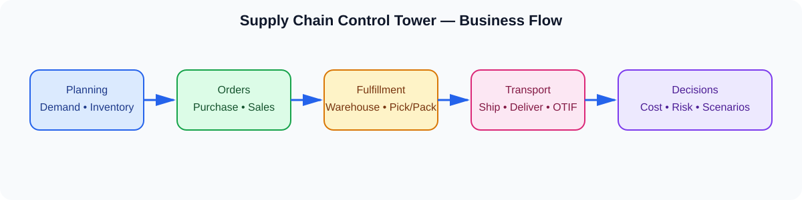
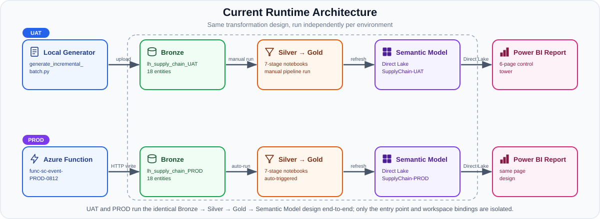

# End-to-End Supply Chain Fabric

An end-to-end supply-chain control tower built with Microsoft Fabric, OneLake,
Power BI, and an Azure event-driven ingestion path for PROD. The solution links
planning, fulfillment, transportation, inventory, risk, and logistics cost into
one fictional but internally consistent operating model.

## Current release

Both environment paths have passed an end-to-end validation:

- PROD: Azure Function → OneLake Bronze → Fabric pipeline → Silver → Gold
  Dimensions → Gold Facts → Semantic Model → Power BI Report.
- UAT: local batch generator → manual UAT Lakehouse Bronze upload → UAT
  pipeline → Silver → Gold Dimensions → Gold Facts → Semantic Model → Report.

Schedules and event triggers remain disabled. Runs are manual and controlled.
The current UAT and PROD paths are intentionally separate at their entry point,
while the transformation design and data contracts remain aligned.

The three report modules that were planned but never built — Transportation &
Shipping, Network & Cost-to-Serve, and Scenarios & Recommendations — have
since been built, promoted from UAT to PROD, and validated end-to-end with
live batches, together with the three Gold facts and the semantic-model
additions behind them. The live report now has 8 pages in both environments.
Phase 5 (portfolio publish) is partially done —
[PORTFOLIO_FINDINGS.md](PORTFOLIO_FINDINGS.md) and the exported report PDF
exist; inline README screenshots and a final QA pass are still outstanding.

UAT and PROD use the same DQ policy: a row-count decrease greater than 30% is
an operational warning; schema, duplicate keys, required nulls, and
referential-integrity violations remain blocking checks.

See [CURRENT_STATUS.md](CURRENT_STATUS.md) for the authoritative live state —
the current validated batch IDs, pipeline job IDs, and the full build log.

## Business purpose

The control tower supports decisions about:

- demand, inventory, safety stock, and supplier risk;
- order fulfillment, warehouse capacity, picking, packing, and dispatch;
- shipment, carrier, route, delivery, and OTIF performance;
- cost-to-serve, logistics cost, disruption impact, and network resilience.

The core business question is: how should the company balance customer service,
inventory, capacity, transportation performance, supply-chain risk, and total
logistics cost?

The live report has 8 pages: Executive Overview, Sales & Demand, Inventory &
Fulfillment, Transportation & Shipping, Network & Cost-to-Serve, Scenarios &
Recommendations, Data Quality Dashboard, and Data Health.



## Current architecture



The shared analytical flow is:

```text
Bronze source files → Silver conformed Delta tables → Gold dimensions and facts
→ Direct Lake semantic model → Power BI report
```

Environment entry points are different by design:

| Environment | Entry point | Bronze delivery | Pipeline | Function |
| --- | --- | --- | --- | --- |
| UAT | `src/generate_incremental_batch.py` | Manual upload to `lh_supply_chain_UAT` | `pl_supply_chain_incremental_UAT` | Not used |
| PROD | `generate_batch` HTTP Function | Function writes PROD OneLake | `pl_supply_chain_event_PROD` | `func-sc-event-PROD-0812` |

PROD resources are isolated in `SupplyChain-PROD` and
`lh_supply_chain_PROD`. UAT resources are isolated in `SupplyChain-UAT` and
`lh_supply_chain_UAT`. No second PROD copy of the shared transformation logic
is required.

## Data and quality contract

The Bronze layer contains 18 linked source entities, conformed 1:1 into 18
Silver tables. Silver normalizes keys, timestamps, statuses, units,
currencies, and duplicates, then records `dq_status` and watermarks. Gold
reads `VALID` Silver rows into 7 dimensions and 8 fact tables.

Required invariants:

- transaction products resolve to a matching product master;
- `order_id` follows `SO-########`;
- new batches advance `source_updated_at` using Spark-compatible UTC timestamps;
- date dimensions cover all relevant Silver fact dates;
- duplicate business keys, required nulls, schema violations, and orphan foreign
  keys block Gold;
- a row-count decrease greater than 30% is recorded as a warning and becomes
  the next accepted baseline after the run.

See [DATA_CONTRACT.md](DATA_CONTRACT.md) for entity grain and raw
field rules.

## Repository guide

- [CURRENT_STATUS.md](CURRENT_STATUS.md) — authoritative current environment
  state and validated checkpoints.
- [OPERATIONS.md](OPERATIONS.md) — generation, upload, deployment, and run
  procedures.
- [PROJECT_PLAN.md](PROJECT_PLAN.md) — business scope, KPI framework, and
  architecture responsibilities.
- [TECHNICAL_REFERENCE.md](TECHNICAL_REFERENCE.md) — notebooks, DQ, semantic
  model, and report conventions.
- [DATA_CONTRACT.md](DATA_CONTRACT.md) — source entities and quality
  contract.
- [PORTFOLIO_FINDINGS.md](PORTFOLIO_FINDINGS.md) — business case, key
  findings, and recommendations for a non-technical audience.
- [LEARNING_PATH.md](LEARNING_PATH.md) — a self-contained curriculum built
  from this project's own files and bugs, for a later teaching session.

## Main folders

- `src/` — local UAT batch and full synthetic-data generators.
- `data/` — local development data and controlled batch fixtures.
- `notebooks/incremental_v2/` — active Fabric transformation definitions.
- `semantic_model/` — semantic model definitions and report-facing metadata.
- `azure_function/event_driven/` — PROD Function package and deployment files.
- `environments/` — destination IDs and bindings; never store credentials.

## Quick start

Structural sanity check on a full local dataset (generator and validator are a
matched pair, both defaulting to `data/raw/dev`):

```bash
python3 src/generate_supply_chain_data.py --profile dev --output data/raw/dev
python3 src/validate_generated_data.py data/raw/dev
```

Generate a dated incremental batch for a UAT run (partitioned Bronze layout
under `data/bronze_batches`; validate its manifest and CSVs per OPERATIONS.md):

```bash
python3 src/generate_incremental_batch.py --date YYYY/MM/DD \
  --source-updated-at YYYY-MM-DDTHH:MM:SS --change-set \
  --output data/bronze_batches
```

For deployment or live execution, follow [OPERATIONS.md](OPERATIONS.md).
Never reuse a delivered batch ID, manually substitute a PROD pipeline run for
the Function path, or enable schedules without explicit approval.
